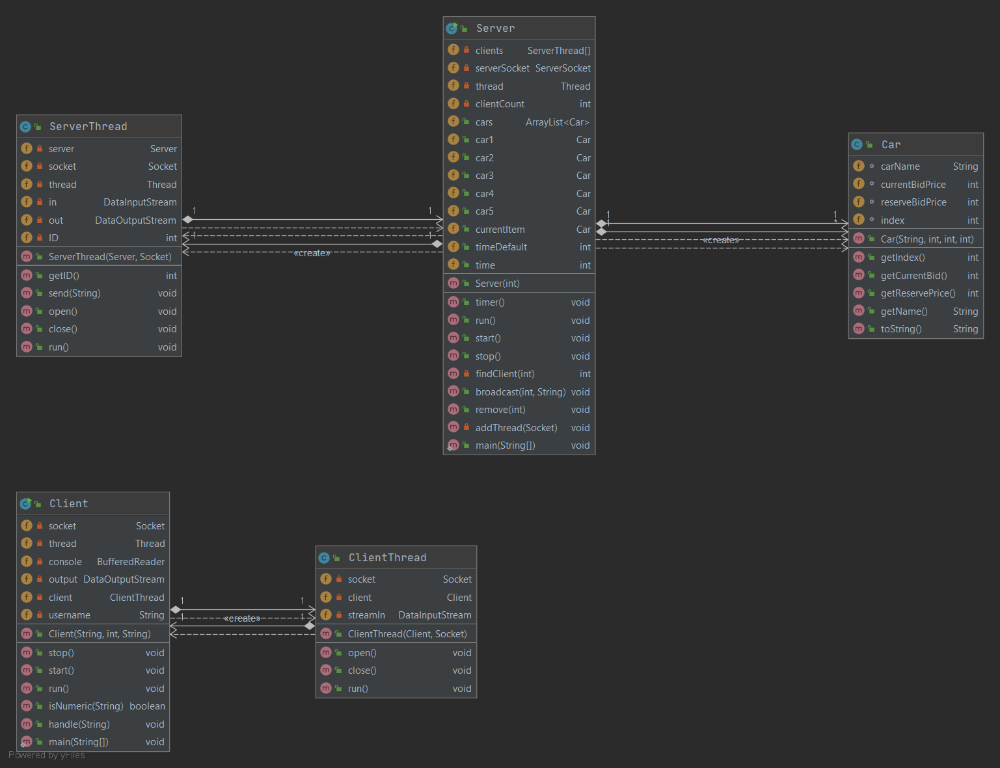

<div align="center">
  <h1>Distributed Systems TCP Auction</h1>
</div>

<!-- Table of Contents -->

## :notebook_with_decorative_cover: Table of Contents

- [Introduction](#introduction)
- [Getting Started](#toolbox-getting-started)
- [System Design](#triangular_ruler-system-design)
- [Directory Structure](#file_folder-directory-structure)

---

<!-- Features -->

## Introduction

Designed and implemented a distributed application that is a simulator of an electronic auction system using Java. This application highlights the logic between the client side and server side, and their ability to communicate with one another. The auction will allow clients to bid on various cars, while the server will support concurrent clients using the auction and provide the logic behind the auction.

---

<!-- Getting Started -->

## :toolbox: Getting Started

To run the distributed application:

1. Open a new command prompt window
2. Go to the location of the directory named "Auction System" and run the following command

```bash
Server.bat
```

This will run the server side of the application and start the auction whilst looking for a client to join.

To see the interaction between multiple clients, run the following two client batch files in separate command prompt windows:

```bash
Client1.bat
```

```bash
Client2.bat
```

This will create two clients named Djibril and Sarah respectively, allowing them to participate in bids.

---

<!-- System Design -->

## :triangular_ruler: System Design



The client-server architecture model is the foundations of this application. The model consists of three components

1. The servers **(class Server)** which host the auction and allows multiple clients to use it concurrently **(class ServerThread** and **ClientThread)**
2. The clients **(class Client)** that use the auction to bid on a car **(class Car)**
3. The network on which the client can gain access to the server and in turn the auction

Its important to mention that the client cannot run without the server, hence when executing the application, the server must be running before a client can join the auction.

---

<!-- Directory Structure -->

## :file_folder: Directory Structure

```
|-- Auction System
|   |-- Car.class
|   |-- Car.java
|   |-- Client.class
|   |-- Client.java
|   |-- Client1.bat
|   |-- Client2.bat
|   |-- ClientThread.class
|   |-- ClientThread.java
|   |-- Item.class
|   |-- Server$1.class
|   |-- Server.bat
|   |-- Server.class
|   |-- Server.java
|   |-- ServerThread.class
|   '-- ServerThread.java
```
